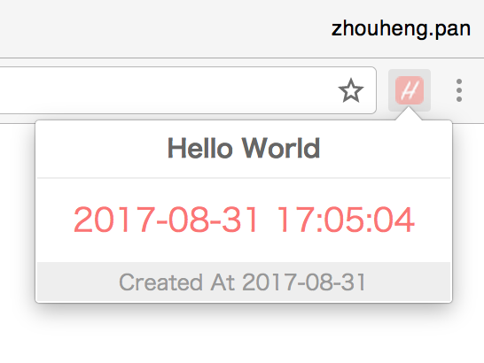
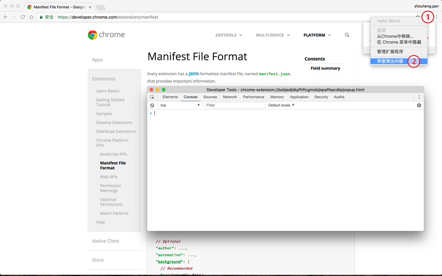
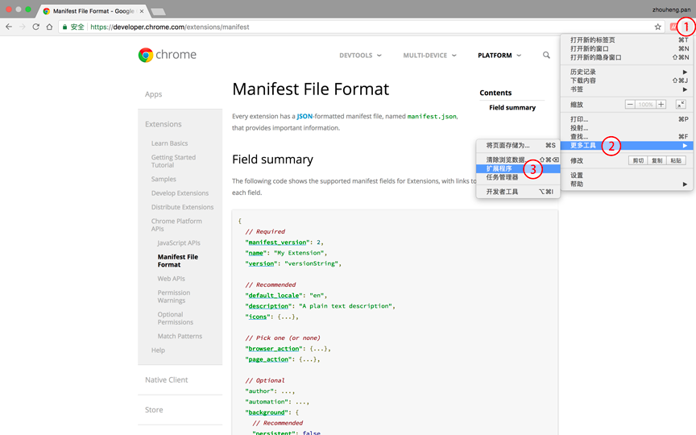
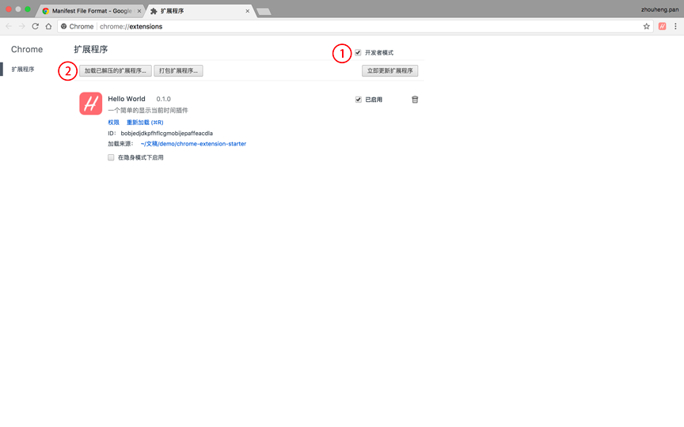

## 如何创建一个浏览器扩展插件(chrome extension)？

这是一个简单的入门教程(Hello World)！  
通过学习此教程，我们将学会如何创建一个chrome浏览器扩展插件(chrome extension)。  

话不多说，先来看看需要完成的功能点：  
* 在chrome浏览器地址栏右边显示一个图标  
* 鼠标停留在图标上显示扩展的名称  
* 点击图标后弹出一个popup  
* popup展示当前日期和时钟  

好啦，需求是不是很简单？是不是分分钟就可以搞出来？  

下面来爆照一下成品的样子，哈哈～  

  

接下来，follow me...  

### 1.代码目录预览  
```
chrome-extension-starter
├── images  # 图标
│   ├── icon_16.png
│   ├── icon_19.png
│   ├── icon_48.png
│   └── icon_128.png
├── manifest.json  # 入口文件
├── popup.html  # popup结构
├── popup.css  # popup样式
└── popup.js  # popup脚本
```

### 2.文件解剖  
* manifest.json  
    既然作为入口文件，那自然很重要咯，这里不做详细介绍。  
    扩展程序的名称、版本、图标、权限、browser_action等等都在这里配置，具体的配置细则详见[详见官方文档](https://developer.chrome.com/extensions/manifest)  
    ```json
    {
        "manifest_version": 2,
        "name": "Hello World",
        "description": "一个简单的显示当前时间插件",
        "version": "0.1.0",
        "author": "panzhouheng <zhouheng.pan@foxmail.com>",
        "icons": {
            "16": "images/icon_16.png",
            "48": "images/icon_48.png",
            "128": "images/icon_128.png"
        },
        "browser_action": {
            "default_icon": "images/icon_19.png",
            "default_popup": "popup.html",
            "default_title": "Hello World"
        }
    }
    ```

* images  
    一波小图标  
    
    
    
    

* popup.html  
    需要注意以下几点：  
    * 不能将js代码写到`<script>`标签内，如`<script>console.log('Hello World')</script>`  
    * 不能动态引入http站点js脚本(可引入可信的https站点的脚本)，如`<script src="http://www.example.com/dist/scripts/popup.js></script>`  
    * 不能将js写到标签的属性里，如`<a href="javascript:;">search</a>`  

    ```html
    <!DOCTYPE html>
    <html lang="en">
    <head>
        <meta charset="UTF-8">
        <link rel="stylesheet" href="popup.css">
    </head>
    <body>
        <div class="helloworld">
            <div class="helloworld-head">
                <h1 class="helloworld-head__title">Hello World</h1>
            </div>
            <div class="helloworld-body">
                <time class="helloworld-body__time" id="time">xxxx-xx-xx --:--:--</time>
            </div>
            <div class="helloworld-foot">
                <span class="helloworld-foot__meta">Created At 2017-08-31</span>
            </div>
        </div>
        <script src="popup.js"></script>
    </body>
    </html>
    ```

* popup.css  
    ```css
    * { margin: 0; padding: 0; }
    * { box-sizing: border-box }
    *:before, *:after { box-sizing: border-box }
    body {
        font-family: "Hiragino Sans GB", "Microsoft Yahei", "Helvetica Neue", Helvetica, Arial, sans-serif;
        font-size: 12px;
        line-height: 1.5;
        background-color: #fff;
        color: #333;
    }

    .helloworld {
        white-space: nowrap;
        text-align: center;
    }
    .helloworld-head {
        padding: 5px 20px;
        border-bottom: 1px solid #eee;
    }
    .helloworld-head__title {
        font-size: 14px;
        color: #666;
    }
    .helloworld-body {
        padding: 10px 20px
    }
    .helloworld-body__time {
        font-size: 18px;
        color: #FB7575;
    }
    .helloworld-foot {
        padding: 2px 20px;
        background-color: #eee;
    }
    .helloworld-foot__meta {
        font-size: 12px;
        color: #999;
    }
    ```

* popup.js  
    ```javascript
    !(function() {
        const $time = document.querySelector('#time');
        const part = parseCurrentDate();
        const delay = 1000 - part.milliseconds;

        display();
        setTimeout(() => {
            display();
            setInterval(display, 1000);
        }, delay);
        
        function display() {
            const part = parseCurrentDate();
            const timeString = `${part.year}-${part.month}-${part.day} ${part.hours}:${part.minutes}:${part.seconds}`;
            
            $time.innerText = timeString;
        }
        
        function parseCurrentDate() {
            const now = new Date();

            return {
                year: now.getFullYear(),
                month: zerofill(now.getMonth() + 1),
                day: zerofill(now.getDate()),
                hours: zerofill(now.getHours()),
                minutes: zerofill(now.getMinutes()),
                seconds: zerofill(now.getSeconds()),
                milliseconds: zerofill(now.getMilliseconds())
            };
        }

        function zerofill(num) {
            if (num < 10) return `0${num}`;
            return num;
        }
    }());
    ```

### 3.调试  
3.1 右键扩展图标  
3.2 点击审查弹出内容  

这不是熟悉的chrome控制台吗？没错，现在你就可以愉快的调试你的扩展程序了  

  

_Note: 1.当点击扩展应用的图标，popup被关闭时，控制台也随之关闭；2.当控制台已打开，点击扩展应用图标之外无法关闭popup时，需关闭控制台即可。_

### 4.安装  
4.1 打开扩展程序面板的方式：  
* 点击右上角菜单 -> 更多工具 -> 扩展程序  
* 在地址栏输入`chrome://extensions` -> 按Enter键  

  

4.2 打开面板后，勾选`开发者模式`，然后点击`加载已解压的扩展程序`即可加载你的插件，加载成功后便将基本信息显示到列表下，如图：  

  

_注：如需发布扩展程序到chrome网上应用商店上，需将程序打包，然后花$5注册成为开发者即可发布_  

至此，全部开发完毕，快去体验一下自己的成果吧！  

> 参考文档  
> * [官方文档](https://developer.chrome.com/extensions) 推荐
> * [360极速浏览器](http://open.chrome.360.cn/extension_dev/overview.html) 有点旧
